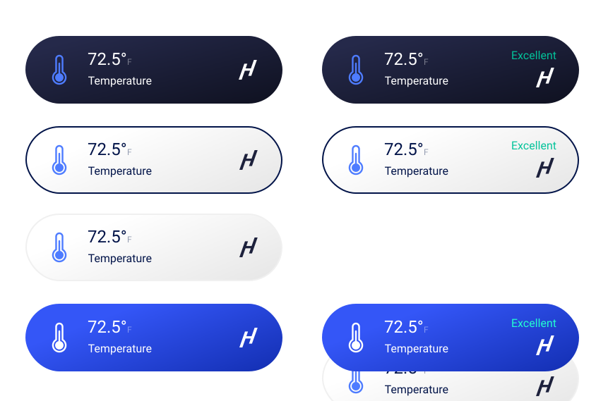

# 🚀 Welcome to IAQJS

## Installation

### NPM

```sh
    npm install iaqjs
```

```jsß
    import IAQ from 'iaqjs'
```

Javascript

```html
    <script src="https://a.iaq.ai/js/iaq.min.js">
    <script>
        var IAQ = new window.IAQ();
    </script> 
```

## Widgets

The library provides 4 different sizes of widgets. Each of these widgets can be further customized with different colors and background gradients. 

These widgets can be placed anywhere on your webpage and doesn't require any additional css

### Sizes

* Mini Widget: Best suited for mobile.

    

* Small Widget

    
    
    
* Medium Widget

    

* Large Widget
    
    

## Colors

* Light

    
* Light2: Light color with borders

    
* Blue:

    
* Dark:

    
## Usage

* Initialize
```typescript
    var AQ = new IAQ("yourClientKey", "customHost" userParams)
    // customHost? String - Optional parameter. When provided IAQ class will makes requests to the custom host instead of https://a.iaq.ai
    // userParam? Object - Optional parameter. When provided IAQ class will append any parameters provided when making requests to host
```
* Add widget to a DOM
    * Call method generate and provide it with a DOM and widget id
```typescript

    AQ.generate(domElement: Element, widgetId: string, options: Options) // Check Options interface
    interface Options {
        theme: 'dark' | 'light' | 'light2' | 'blue',
        size: 'mini' | 'small' | 'medium' | 'large',
        bgGradient?: Boolean, // Set a background gradient - Default true
        iconMode?: Boolean // on size mini and small show icon or radial graph Default true
    }
```
* Data: You can also retrieve data by calling the method data

```typescript
    // Promises and async/await supported
    AQ.data("widgetId").then(function(result) {
        // result is a data Object. Check Reference below
        console.log(result)
    })

     interface Data {
        name: String,
        measurements: Array<Measurement>
    }

    interface Measurement {
        type: string,
        curVal?: string,
        curScore: string,
        icon: string,
        unit?: string,
        name?: string,
        toUse?: string // some measurement only have curScore, toUse denotes what to display
    }
```

